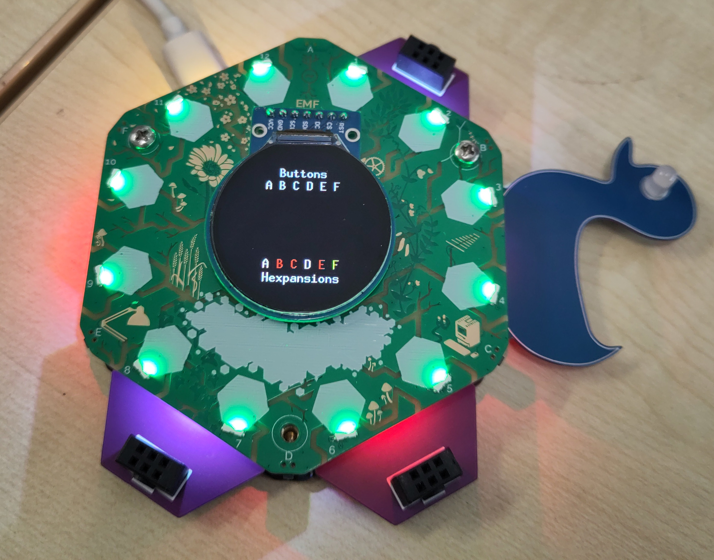

# Demo (2024 top board)

A brief demo showing off:

- Display
- Buttons
- Hexpansion slot power control and detection
- LEDs

Briefly (<1s) pressing a button enables the corresponding hexpansion port.
Pressing a button for any longer disables it.

Hexpansion port statuses are indicated by the hexpansion illumination LEDs and on the display:

- red: disabled
- amber: enabled but no hexpansion demanding power
- white: enabled and hexpansion present and demanding power

