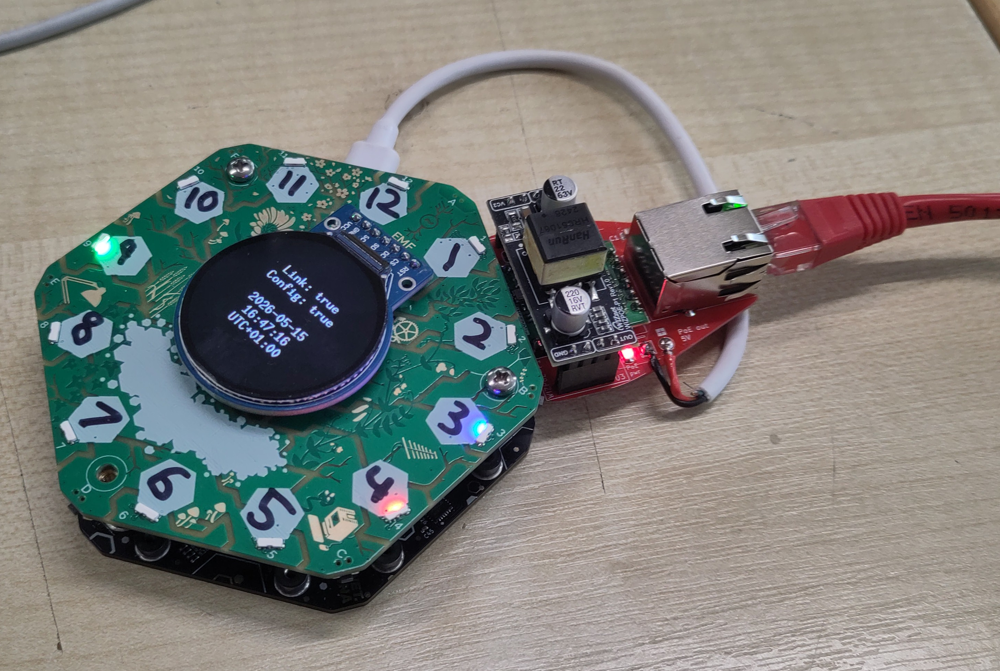

# Ethernet (and PoE) using [ethernet hexpansion](https://github.com/DanNixon/ethernet-hexpansion)

Shows:

- configuring the W5500 with the slightly cursed SPI pinout involving the port expanders
- DHCP
- SNTP
- the most basic RGB clock in the world using the 2024 front board

